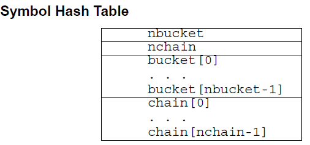
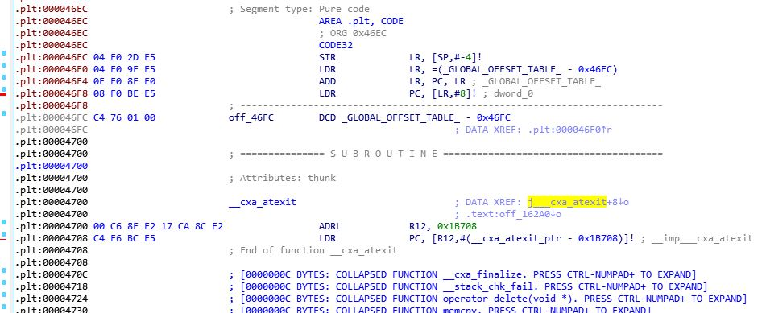
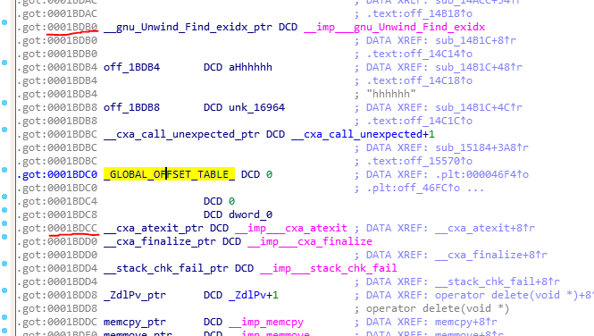
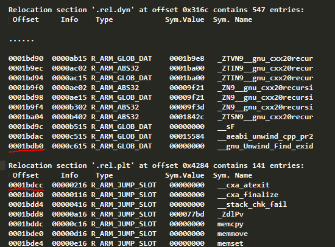

author: giglf

[TOC]

---

# 基础知识

***以下思路公式均基于32位的.so文件***

1. 根据Android Linker的代码可知，so的加载过程并不需要用到section信息，但需要segment的信息，segment的信息完整的保留了下来

2. 针对的是so文件（Shared library），必定包含`.dynamic section` 

3. 对于offset和addr的确定，通过segment的offset和vaddr确定，合并于同一个segment的section，则紧接上一个section对齐后的地址

4. `.hash`的结构决定了只要定位起始位置便可确定其大小

   

5. ELF将`GOT`表拆分成了两个表`.got` `.got.plt` , 其中`.got`用来保存全局变量引用的地址，`.got.plt`用来保存函数引用的地址。

   并且，`.got.plt` 的第一项为`.dynamic` 段的地址，第二项为本模块的ID，第三项为`_dl_runtime_resolve()` 的地址。

   `.got.plt`在ELF文件中的段名为`.plt`

   而`.plt`段中，每一项占12字节，每一项都是一小片段代码

   

6. 在`.got`中，以`_global_offset_table_`作分界，在其之前为`.rel.dyn` ，在其之后半部分为`.rel.plt` ，因此可知道这种方式计算出`.got`的尾部

   

   

7. `.bss` section属性为NOBITS，长度信息无关紧要

# SO结构信息读取

#### ELF Header (Elf_Ehdr) ELF文件头

1. 读取第5个字节，判断ELF为32位还是64位，define相应的宏
2. 直接按结构体大小读取header头部

#### Sections Header (Elf_Shdr) 节区头部

* ELF_Chdr（Section compression header）When SHF_COMPRESSED is set.

1. 通过Elf_Ehdr.e_shoff确定Section Table的偏移
2. 通过Elf_Ehdr.e_shnum确定Section的个数
3. 通过Elf_Ehdr.e_shentsize确定Section数据结构的大小
4. 通过Elf_Ehdr.e_shstrndx确定字符串Section的索引

#### Symbol Table (Elf_Sym) 符号表

* ELF_Syminfo 
  * The syminfo section if available contains additional information about
       every dynamic symbol.
* *暂不知作用

####Program Header (Elf_Phdr) 程序头部

1. 通过Elf_Ehdr.e_phoff确定Program Header Table的偏移
2. 通过Elf_Ehdr.e_phnum确定Program (segment)的个数
3. 通过Elf_Ehdr.e_phentsize确定Program Header 数据结构的大小

---

# 修复思路

* segment table完整

**p_type == PT_INERP** : 直接映射到`.interp` 节 **addr = offset**

**p_type == PT_DYNAMIC** : 直接映射到`.dynamic` 节 

**p_type == PT_ARM_EXIDX** : 直接映射到 `.ARM.exidx` 节 **addr = offset**

### 直接定位

定位到`.dynamic` 节，通过 entry tag确定section信息

* ​

  * `DT_STRTAB`, `DT_STRSZ` => `.dynstr`	
  * `DT_SYMTAB`, `DT_SYMENT` => `.dynsym` 
  * `DT_RELA` , `DT_RELASZ`, `DR_RELAENT` => `.rela`

* `DT_INIT` => `.init`

* `DT_FINI` => `.fini`

  * `DT_REL`, `DT_RELSZ`, `DT_RELENT` => `.rel.dyn` 
  * `DT_JMPREL`, `DT_PLTRELSZ` => `.rel.plt`
  * `DT_INIT_ARRAY`, `DT_INIT_ARRAYSZ` => `.init_array` -> s_addr
  * `DT_FINI_ARRAY`, `DT_FINI_ARRAYSZ` => `.fini_array` -> s_addr

### 间接确定

- `DT_HASH` => `.hash`

  读前面两项
  $$
  size = (nbucket + nchain + 2) * sizeof(int)
  $$

- `.plt` => 起始位置即为`.rel.plt`的末尾，上面处理可知`.plt`的offset和vaddr，plt 由固定16 字节 + 4 字节的`__global__offset_table` 变量和n 个需要重定位的函数地址构成，函数地址又与rel.plt
  中的结构一一对应。故
  $$
  size = 20 + 12 * (rel.plt.size) / sizeof(Elf32\_Rel)
  $$

- `.got` => `.got` 紧接着`.dynamic` ，并且，通过`DT_PLTGOT` 获得`_global_offset_table_`的地址，通过`.rel.plt` 的size算出`.got` 的尾地址，以此计算出`.got` 的size
  $$
  size = addr(\_global\_offset\_table\_) +4*(.rel.plt.size)/sizeof(ELF32\_Rel) + 4*3 - addr(.got)
  $$

- `.data` => `.got` 的尾部即为.data段的地址，因为`.bss`不占空间，故`.data` 段的尾部即为load2的尾部

- `.bss` => `.bss`紧接`.data` ，但为NOBITS属性，其size无关紧要

- `.shstrtab` => 储存各header name，放在section header的尾部，并把`string table index` patch回到elf_header

- `.text &.ARM.extab ` => offset和vaddr通过plt的末尾得到，长度通过`.ARM.extab` 的起始位置和plt的末尾位置计算所得，但未能想到区分方法，暂时合并，修复后的`.ARM.extab` 在ida会解析错误

# 修复分类

分类，鉴定section的损毁程度，按照缺失信息逐个修复

在此，把读到的so文件分为几种不同的情况，进行修复

1. segment损毁、非elf文件，完全损毁，无法加载，放弃修复
2. 单纯从elf_header抹去section偏移等信息，直接通过读取section，修复
   * 通过number和section header entry size计算出section header的大小，从尾部偏移到，修复elf头
3. 只抹掉section的addr和offset，size及其他信息都有保留。此时elf_header中仍然包含section header的偏移，是完整的，定位到section header table
   * 通过elf_header定位到section header
   * 逐个section header读取size，对应segment，进行修复
   * 这种修复能最大可能修复到so的原本状态
4. section面目全非，直接通过上面思路进行section header的重建

上述情况中，2的情况可能性不大，为此着重考虑3、4两种修复方式

# 修复方案

针对上述情况，修复方案分成Plan A 和Plan B

### Plan A

在经过校验`ELf Header ` 和`Program header` 完整，而`Section Header` 仅仅丢失addresse和offset的情况下选择

抽出shdr_table部分，根据`Program header` LOAD的部分和每个section的size修复相应的address和offset

最后结合输出到文件

### Plan B

B方案比较复杂，首先讨论一个问题，什么情况下会出现section缺失的情况

1. so文件经过人为的混淆，防止被逆向静态分析
2. 该so文件是在调试的时候从内存dump出来的。elf的执行视图不包含section字段

因为so文件是从内存中dump出来的，自然包含有偏移

总结出一种统一的修复方式，先模拟加载so到内存，然后记录下相应的soinfo，就像Android源码中的LOAD操作一样（详情参考《AndroidSO加载过程》），然后从soinfo中获取so的信息，rebuild section header，最后整合到rebuild的文件中。

读取，加载的大部分代码可以直接从Android源码中修改过来